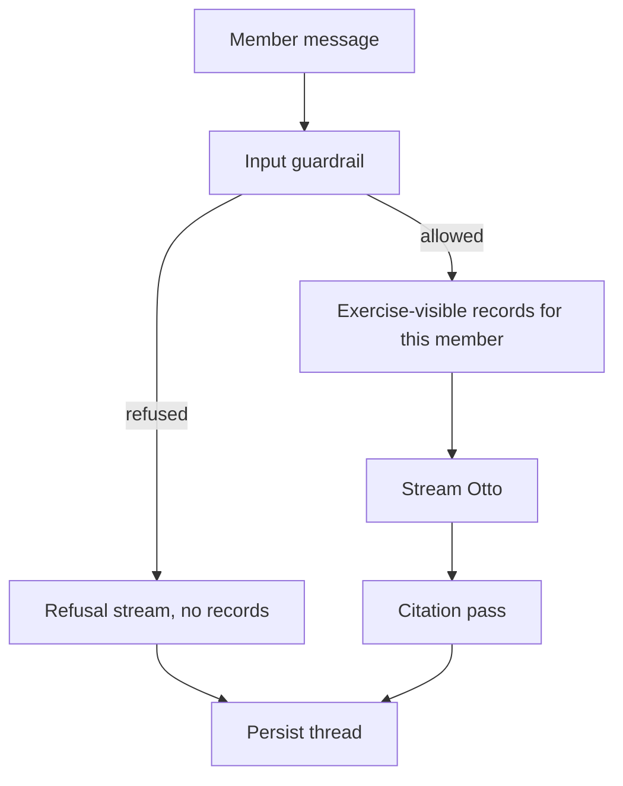

# The coach that remembers

Decision document for the trial slice. Setup and tests are in [DEV.md](DEV.md).

## Problem

Members of a leadership programme submit a weekly exercise, get AI feedback, and later say whether they followed through. The feedback can be useful, and it can also feel disconnected from what they committed to before. The client asked how the next reply can build on an earlier exercise and commitment, while using only information that belongs in that flow.

Sensitive text is in the same store: private chat, and records that belong to other members. A prompt line is not an access control.

## This slice

The demo is the chat and the coach. A member picks a trusted session, writes what happened, and gets a reply from Otto.

The pipeline is linear application code:

1. An input guardrail classifies the latest message. Off-topic requests get a short refusal, with no member records in that call.
2. On topic, the server loads this member's exercise-visible history, formats it, and streams Otto.
3. After the reply, a citation pass names which earlier exercises and commitments actually shaped it, and why. That explanation is stored on the assistant message and shown in the chat as “Prior work”.

Live coaching still goes through the AI Gateway (guardrail, coach, citations). There is no offline coach adapter that invents new replies.

`AI_GATEWAY_API_KEY` is optional. Without it you can run the app, switch sessions, and open **session-202**, which is seeded with a sample member message, Otto reply, and Prior work citations so the revised-commitment idea is visible without a model call. Sending a new message needs a real key.

Models are named in one enum (`AI_MODELS`: chat, guardrail, citations) and called through the AI Gateway, with `AI_MODEL_FALLBACKS` if the selected model does not answer. The coach prompt is a shortened form of the existing Otto base prompt (`docs/BASE_PROMPT.md` → `docs/SIMPLIFIED_PROMPT.md`).

Out of this slice: authentication, saving a new commitment, a human operator, a quality score, and retrieval over a long history.

## Questions

Asked upfront:

| Question                                                            | Answer                                                                                                                                                                                                                                                                    |
| ------------------------------------------------------------------- | ------------------------------------------------------------------------------------------------------------------------------------------------------------------------------------------------------------------------------------------------------------------------- |
| What KPI or measurement strategy scores coach quality?              | None. An evaluation system would belong here. This repo checks the pipeline. Reply quality is unscored.                                                                                                                                                                   |
| What does "build on an earlier commitment" mean in practice?        | An existing Otto base prompt, and nothing else on coaching behaviour. I shortened it for the prototype and steered it from assistant behaviour toward guidance: one observation, one question that makes the member think, induction rather than doing the work for them. |
| Is there a human operator branch?                                   | No.                                                                                                                                                                                                                                                                       |
| What privacy story is shown to members, so the system can match it? | No particular need for this slice.                                                                                                                                                                                                                                        |
| How much earlier experience belongs in the prompt?                  | With a fixture this small, all of the allowed records. With years of records for one person, that stops being a good idea. See below.                                                                                                                                     |

Assumption that stayed open: the trusted session id is the member. There is no login.

## Earlier history, once it is no longer small

On the supplied data, stuffing the allowed records into the prompt is fine. There are three members and a handful of rows. A retriever would be extra machinery for a fixture this small.

A real programme outgrows that. One member, over years, will have more exercises and commitments than a coach should read on every turn, and more than should sit in a context window. Relevance also stops being "the latest open commitment." Someone struggling with a difficult employee may need an older note about team discipline or a performance framework. A dump of recent weeks buries that note. A plain semantic search can miss it too, because the words in the new exercise and the words in the old record often diverge.

At that size I would build a pipeline in front of the same coach, still without an agent framework:

1. Find records. Keep earlier experiences in a vector database and search with hybrid retrieval: semantic similarity, plus keyword search. A model can propose search terms beyond the member's own wording. "I cannot manage this person" might yield team discipline, performance frameworks, feedback conversations. Those terms go back into the search so an older record can surface when the wording diverges.
2. Assemble and run. Scaffold a short context from the hits, keep the thread, and run the same workflow: input guardrail, coach, with only those records in the prompt.
3. Check the reply. After generation, check that the message still behaves like the coach: grounded in what they wrote, one reflective question, a follow-through claim only when the record says completed, the live commitment kept current, private and other-member text absent.

The prototype stops before that. `listCoachContext` loads every exercise-visible row for the member.

## Decisions

### 1. Chat and coach behaviour, as a straight pipeline

|               |                                                                                                                                                                          |
| ------------- | ------------------------------------------------------------------------------------------------------------------------------------------------------------------------ |
| Choice        | One Next.js app. Guardrail, coach stream, citation pass, written as ordinary functions.                                                                                  |
| Alternative   | Mastra, LangGraph, or another orchestrator. The brief allows them.                                                                                                       |
| Why this fits | The work is three model calls in order. Nothing chooses tools, loops, or hands off to another agent. Simplicity mattered more than a graph I would then have to explain. |
| Given up      | No graph debugger, no built-in agent memory, no place to drop a new specialist without writing the step myself.                                                          |
| Revisit       | If the coach must call tools, or the flow gains real branches a graph would make easier to see.                                                                          |

### 2. Full TypeScript, Next.js as the application

The brief allows TypeScript or Python. I kept the AI service in the same language as the UI.

Around Next.js: Zod on the request, React Hook Form where a form needs it, shadcn for the screen, Vitest for tests, Prisma for Postgres.

|               |                                                                                                                          |
| ------------- | ------------------------------------------------------------------------------------------------------------------------ |
| Choice        | Next.js App Router, chat on `POST /api/chat`, data access in `src/server`.                                               |
| Alternative   | A Python AI service beside a small React app.                                                                            |
| Why this fits | The slice is one request path from the member screen to the model. One deploy, one message schema, one place to debug.   |
| Given up      | Python notebooks and the usual Python eval libraries sit outside this app. A later evaluation job could still be Python. |
| Revisit       | If model work splits into a separate team or a separate scaling problem from the member app.                             |

### 3. The whole allowed history goes in the prompt

|               |                                                                                                                                                                                        |
| ------------- | -------------------------------------------------------------------------------------------------------------------------------------------------------------------------------------- |
| Choice        | For this fixture, `listCoachContext` returns every exercise-visible record for the member. The prompt tells Otto how to use continuity, a superseded commitment, and an empty history. |
| Alternative   | The retrieval pipeline above, built now.                                                                                                                                               |
| Why this fits | The dataset is tiny. A bad retrieval score would hide whether the coach can use a record it was actually given.                                                                        |
| Given up      | Years of records will overflow a useful context. Irrelevant completed commitments can crowd a reply if the history grows and the prompt stays a full dump.                             |
| Revisit       | When one member's history no longer fits a useful context, or when replies start anchoring on the wrong week.                                                                          |

## Stack

### shadcn

It covers the components this screen needs, the examples are everywhere, and coding agents already know the patterns.

Not chosen:

- Material UI: heavy theme, generic look
- Mantine: another full kit, fewer paste-in examples
- Base UI or Radix alone: primitives, every component still to assemble

### Prisma

The schema is small and relational: member, trusted session, records, scenario, thread, messages. Prisma is comfortable at that size, stays comfortable if the schema grows, and the Postgres adapter can be swapped. Visibility, commitment status, and thread ownership are relations with invariants. A document store would leave those checks to application code.

Drizzle would also have been a sound Postgres choice. I took Prisma for the client and the migration workflow.

### AI SDK and the gateway

Calls go through the Vercel AI SDK (`ai`, `@ai-sdk/react`), aimed at the AI Gateway. The direct OpenAI SDK was the other obvious client.

The gateway is where model swaps, provider fallbacks, and pricing sit. `AI_MODELS` holds the primary ids; `AI_MODEL_FALLBACKS` lists backups as `providerOptions.gateway.models`. `useChat` speaks the same UI message stream the server writes, so the chat client uses that stream as-is.

OpenRouter in front of the same AI SDK would have been a real alternative: same `streamText` and `useChat`, different router. I stayed on the Vercel gateway so the app, the model route, and the logs are one stack when something breaks.

Other Next.js plus React chat integrations, and why they lost:

- OpenAI SDK and a hand-rolled SSE parser: the React hook would be mine to maintain
- assistant-ui: a second chat UI layer on top of shadcn
- A Mastra or LangGraph chat route: streaming exists, and it expects the orchestration I skipped in decision 1

## Privacy

Privacy is the part I would take most seriously in production. The infrastructure there is heavier than this demo. This section is a stub for that discussion.

What the prototype already enforces in code:

`listCoachContext` reads records for the trusted session's member where visibility is `exercise`. Private chat and other members' rows stay in the database and out of the system prompt. The refusal path skips coach context entirely. The prompt states that the filter already happened, so the model has no private text to reach for.

Not decided here:

- What a member is shown about what the coach can see
- Where prompts, completions, and citation traces are stored, and who can read them
- Retention, deletion, and whether a provider may train on this text

## Evaluation and failure

The brief defines no quality metric, and the app has none. Vitest covers request shape, context formatting (including no-history), the privacy query, the guardrail branch, and the citation id check. Coaching quality stays outside the suite. After launch I would want a labelled set: continuity, revised commitment, empty history, private text absent from the model input, and a rubric for observation, one question, and follow-through claimed only when a record says completed.

Failure in the prototype:

- Invalid body returns 400. Unknown session returns 404.
- Guardrail refusal streams a decline and omits records.
- If the citation pass throws, the coaching reply still persists.
- The screen shows a spinner while streaming and an alert when the request fails.
- Provider and model fallback stay on the gateway (`AI_MODEL_FALLBACKS`). The app has one client. If the key is missing, every model fails, or the gateway is down, a new send shows the alert; session-202 still shows its seeded thread.

## Next

- Expand the privacy section once the production constraints are settled.
- Add an evaluation set for coaching quality.
- Replace the full-history prompt with the retrieval pipeline when a member's record count makes the dump a liability.
- Add the post-generation coaching check from that pipeline. The current citation pass only explains which records were used.

